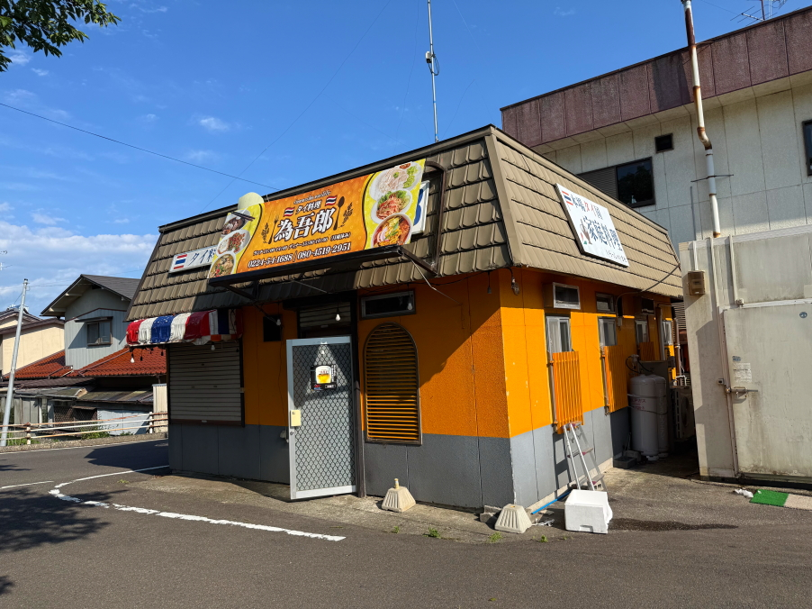
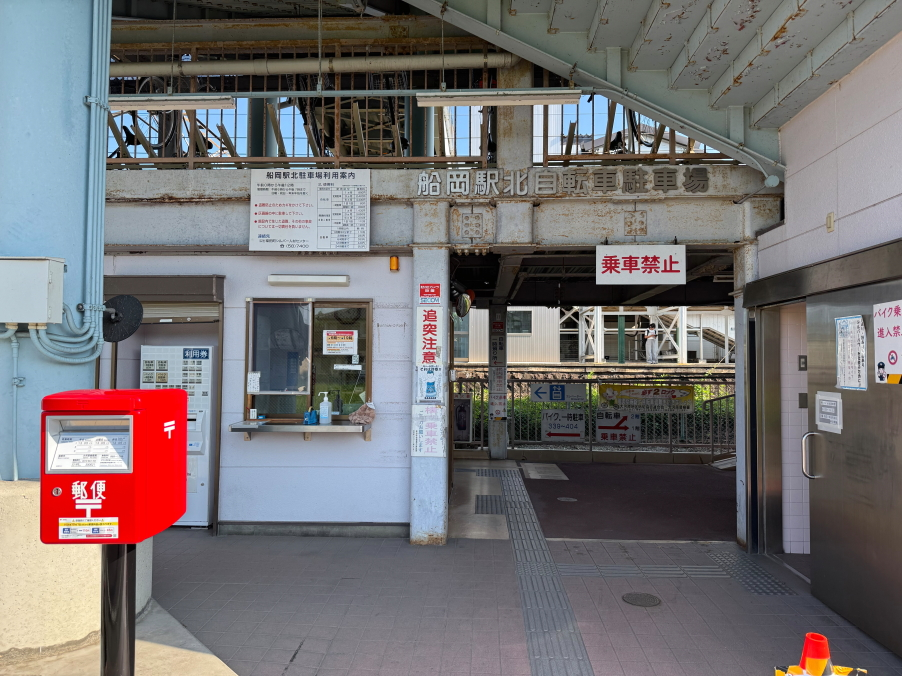
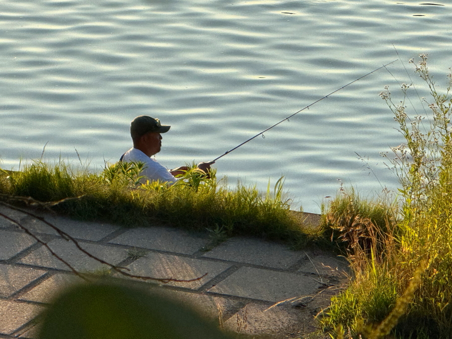

# 20250630_tochigi

<html lang="ja" data-loaded="false" data-scrolled="false" data-spmenu="closed">
<head>

<meta charset="UTF-8">
<meta http-equiv="Content-Type" content="text/html; charset=UTF-8">
<meta http-equiv="X-UA-Compatible" content="IE=EmulateIE10" />
<meta http-equiv="X-UA-Compatible" content="IE=edge">

<meta name="viewport" content="width=device-width, initial-scale=1.0">

<!--ここから上はお決まりの定型文です-->

<!--ここからが表現の書式などを決めるcssという部分-->

<link href="https://cdnjs.cloudflare.com/ajax/libs/lightbox2/2.7.1/css/lightbox.css" rel="stylesheet">

</head>

<body>

モバイル端末をお使いの場合は、画面を横向きにすると
より見やすくご覧頂けます。

<!--ここ上は、ほぼそのまま使います！-->

<!--QRコードの挿入例-->

 アクセス用QRコード

<marquee direction="left" scrollamount="20" width="30%">(^_^)/~alis</marquee>

<!--流れ文字の挿入例-->
<h1><marquee behavior="left">!!! 2025/06/27-30、ショッピングモールの屋台から、宮城県白石川の景観!!!</marquee></h1>

                          

<!--ここから下が、本体部分-->

    
    
    
<h2>27日は、BellMallの屋台から</h2>

    
<h2>梅雨明けしたのでは？と思えるほどの青空です</h2>

    
<h2>プール入り口も夏の景観</h2>

    
<h2>入り口のお花達も陽射しを浴びて輝きました</h2>

    
<h2>お花屋さんのお花達も綺麗に咲いています</h2>

    
<h2>夕方の西の空には細い月が浮かびました</h2>

    
<h2>28日も、真夏のような青空</h2>

    
<h2>庭の薔薇は第二陣が咲きました</h2>

    
<h2>28日は、宮城県に移動、国道沿いのスーパーでお買い物</h2>

    
<h2>蘭のお花が見事でした</h2>

    
<h2>宮城県柴田郡柴田町の知人宅に到着</h2>

    
<h2>家の向かい側は白石川</h2>

<h2>最寄駅は東北本線の船岡駅</h2>

    
<h2>手作りのお料理でおもてなしされました</h2>

    
<h2>白石川の夕暮れ</h2>

    
<h2>釣り人が糸を垂れています</h2>

    
<h2>夕焼けどきは綺麗でした</h2>

    
<h2>29日は知人宅から見える朝日でスタート、AM4:27</h2>

    
<h2>朝食は手作りタイ料理</h2>

    
<h2>仙台近郊の漁港とSUGOサーキットをハシゴ</h2>

    
<h2>漁港では海の幸をいただきます</h2>

    
<h2>購入品は無料の炭火で調理できます</h2>

    
<h2>一般参加のセリが始まりました、競り落とし価格はびっくり価格</h2>

<h2>セリの様子が動画で撮れてます</h2>
<iframe width="560" height="315" src="https://www.youtube.com/embed/x1S0iaty_j4?si=-UUP5cDI4xHa3ltT" title="YouTube video player" frameborder="0" allow="accelerometer; autoplay; clipboard-write; encrypted-media; gyroscope; picture-in-picture; web-share" referrerpolicy="strict-origin-when-cross-origin" allowfullscreen></iframe> 
    
<h2>SUGOサーキットに出店している知人のつてでサーキットに入りました</h2>

    
<h2>午前の最後は2輪レースの予選で、先頭集団のゴールした後ろ姿が撮れました</h2>
    
<iframe width="560" height="315" src="https://www.youtube.com/embed/XR_ZAnQ9xgU?si=ev7m_BSUxhvJyPLb" title="YouTube video player" frameborder="0" allow="accelerometer; autoplay; clipboard-write; encrypted-media; gyroscope; picture-in-picture; web-share" referrerpolicy="strict-origin-when-cross-origin" allowfullscreen></iframe> 

<h2>帰り道に寄ったスーパーのダリアが見事でした</h2>

    
<h2>夕食は漁港で仕入れた新鮮なお魚</h2>

    
<h2>陽が傾くと日輪が見事</h2> 

    
<h2>最上部には彩雲が綺麗</h2>

<h2>上空は航空機の通り道で、飛行機雲がにぎやか</h2>

    
<h2>29日の夕暮れも見事に綺麗</h2>

    
<h2>30日の朝が明けます、AM3:57</h2>

    
<h2>30日、AM5:18</h2>

    
<h2>30日、月曜の朝7:50ですがすでに釣り人が居ます</h2>

    
<h2>宇都宮に帰る途中、東北道のパーキングで見たこけし</h2>

    
<h2>最後はいつものショッピングモール、トイレのお花が綺麗でした</h2>

    

         

   
  
<h2>今日のBGMは A Letter You Never Sent | Soft Romantic Ballads for Quiet Hearts</h2>
<iframe width="560" height="315" src="https://www.youtube.com/embed/Z0uxZwkiX_A?si=0FQBJHgxTDxntXZ1" title="YouTube video player" frameborder="0" allow="accelerometer; autoplay; clipboard-write; encrypted-media; gyroscope; picture-in-picture; web-share" referrerpolicy="strict-origin-when-cross-origin" allowfullscreen></iframe> 

    
    
    <h3>「雪の中で輝くシンデレラ」by まいてゃ</h3>
<h2><a href="https://torokoid.github.io/20250219_chiangrai/maitiyaz.mp3" target="_blank">この文字クリックで再生します 下の再生ボタンでも同じ曲をループ再生します</a></h2>

    <audio controls loop>
        <source src="https://torokoid.github.io/20250219_chiangrai/maitiyaz.mp3" type="audio/mpeg">
        お使いのブラウザは audio タグをサポートしていません。
    </audio>

    
<!--
  
<h2>スティーブ・ジョブズの伝説の講義</h2> 
<iframe width="560" height="315" src="https://www.youtube.com/embed/XsRpvWHIVw0?si=f7IA0pv9iZWVk3VH" title="YouTube video player" frameborder="0" allow="accelerometer; autoplay; clipboard-write; encrypted-media; gyroscope; picture-in-picture; web-share" referrerpolicy="strict-origin-when-cross-origin" allowfullscreen></iframe>    
    
    
<h2>スティーブ・ジョブズ氏の講義の内容が「笑って死ぬ」by まいてゃ さんの歌の内容と大筋で同じに聞こえます 以下に再掲しますね</h2>

    
<h3>歌の後半部分しか撮れてませんが、2月16日のイベントで公開された「笑って死ぬ」 by まいてゃ 白ドレスはダンサーの玖遠さん、黒いドレスがまいてゃさん</h3>
<iframe width="560" height="315" src="https://www.youtube.com/embed/s4ZcbxAluMM?si=Xa32xo19UCNaWv0v" title="YouTube video player" frameborder="0" allow="accelerometer; autoplay; clipboard-write; encrypted-media; gyroscope; picture-in-picture; web-share" referrerpolicy="strict-origin-when-cross-origin" allowfullscreen></iframe> 
-->
    

    <h3>お気に入りの「笑って死ぬ」 by まいてゃさんも再々掲です</h3>
<h2><a href="https://torokoid.github.io/20250221_chiangrai/maitiya3.mp3" target="_blank">この文字クリックで再生します 下の再生ボタンで同じ曲をループ再生します</a></h2>

    <audio controls loop>
        <source src="https://torokoid.github.io/20250221_chiangrai/maitiya3.mp3" type="audio/mpeg">
        お使いのブラウザは audio タグをサポートしていません。
    </audio>

   
<h2>以上、ショッピングモールの屋台から、宮城県の白石川の景観からトイレのお花まででした。 ここまでご覧いただきありがとうございました。</h2>

     
<h2>
<a href="https://torokoid.github.io/Mashiko_himawari_3/" target="_blank">クリックでメニューページに戻ります</a>
</h2>

   

         

  

      

<!--本体はここまで-->

<!--画面に空白地帯を作って、背景が見えるようにしています-->
                                              

<!-- フッタ -->
<footer>

Copyright 2025/06/30 alis @Tochigi

</footer>

<!--HPにさまざまなJavaScriptを呼び込むための書式-->

    
    </body>
    
</html>
